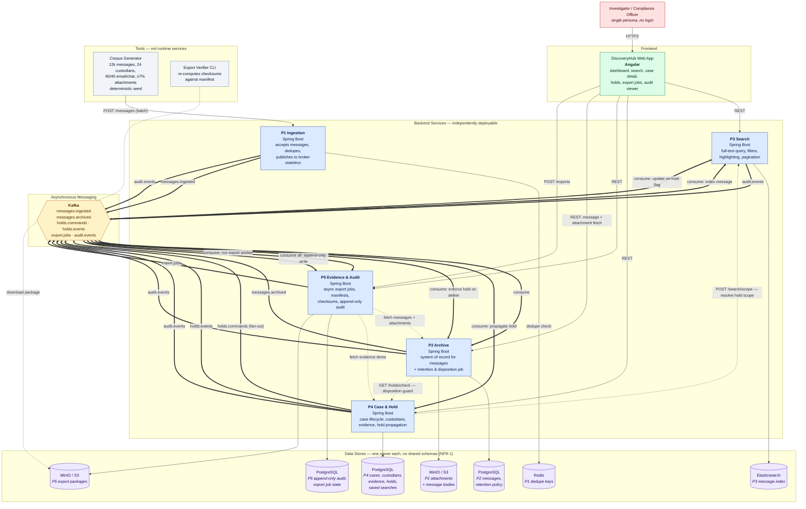

# DiscoveryHub — Architecture

Container-level view (C4 level 2). One persona, five independently deployable backend
services, one frontend, asynchronous messaging between services, and a private datastore
per service.

## Container Diagram

Legend: solid bold arrows (`==>`) are asynchronous Kafka flows, thin solid arrows are
synchronous REST calls, dashed arrows are synchronous service-to-service REST calls.

## Service Ownership

| Service | Owner | Functional requirements | Private data |
|---|---|---|---|
| P1 Ingestion | A | FR-1.1, FR-1.4, FR-1.6 | Redis dedupe keys |
| P2 Archive | A | FR-1.5, FR-1.7, FR-5 | PostgreSQL + object store |
| P3 Search | B | FR-3 | Elasticsearch |
| P4 Case & Hold | C | FR-2, FR-4 | PostgreSQL |
| P5 Evidence & Audit | D | FR-6, FR-7 | PostgreSQL + object store |
| Frontend shell, API clients, infra, CI | E | FR-8 | — |
| Corpus generator, export verifier | A / D | FR-1.2, FR-1.3, FR-6.5 | — |

## Kafka Topics

| Topic | Producer | Consumers | Purpose |
|---|---|---|---|
| `messages.ingested` | P1 | P2 | Decouples accept from store (FR-1.4) |
| `messages.archived` | P2 | P3 | Index within 30s of ingestion (FR-1.7) |
| `holds.commands` | P4 | P4 workers | Async fan-out over large hold scopes (FR-4.3) |
| `holds.events` | P4 | P3, P2 | Propagate hold status to index and delete guard (FR-4.2) |
| `export.jobs` | P5 | P5 workers | Async export with retry safety (FR-6.2, FR-6.6) |
| `audit.events` | P1, P2, P3, P4 | P5 | Chain of custody from every service (FR-7.1) |

## Key Design Decisions

1. **Ingestion is stateless; Archive is the system of record.** P1 only validates, dedupes,
   and publishes. This satisfies FR-1.4 literally — the component accepting messages is not
   the one storing them — and means an Archive outage cannot lose messages, they queue in
   Kafka and drain on recovery (NFR-2).
2. **Idempotency is enforced twice.** A fast Redis check in P1 on `externalId`, plus a unique
   constraint on `externalId` in P2. Redis is an optimisation; the database constraint is the
   guarantee, so a Redis flush cannot create duplicates (FR-1.6).
3. **Hold status is duplicated into the search index, not joined at query time.** P3 keeps an
   `onHold` flag updated from `holds.events`. This keeps the on-hold filter (FR-3.2) inside a
   single Elasticsearch query and holds P3 to the 2-second budget (NFR-3), at the cost of brief
   eventual consistency after a hold is placed.
4. **The disposition guard is a synchronous call, not the cached flag.** P2's retention job
   calls `GET /holds/check` on P4 before deleting. Deletion of held data is the one place where
   eventual consistency is unacceptable — a stale flag would destroy evidence (FR-4.2, FR-5.2).
   If P4 is unreachable, the job fails closed and deletes nothing.
5. **Audit is write-only downstream of Kafka.** P5 exposes no update or delete path, and every
   service emits its own audit events rather than P5 inferring them. Append-only is enforced at
   the API surface and by table permissions (FR-7.3).
6. **Export packages are built in a temporary location and moved on completion.** A failed job
   never leaves a partial package in the download path, so retries cannot produce corrupt or
   duplicate output (FR-6.6).

## Resiliency Notes (NFR-2)

- **P2 down:** ingestion continues, `messages.ingested` accumulates, P2 drains on restart.
  Search and cases remain fully functional; only message-body fetch degrades.
- **P3 down:** search UI shows a degraded banner; ingestion, cases, holds, and export continue.
  The index catches up from `messages.archived` on restart.
- **P4 down:** search and browse continue read-only; hold placement is rejected, and P2's
  disposition job fails closed rather than deleting unverified data.
- **P5 down:** all workflows continue; audit events buffer in Kafka and are consumed on restart.
  No action is silently lost from the chain of custody.
